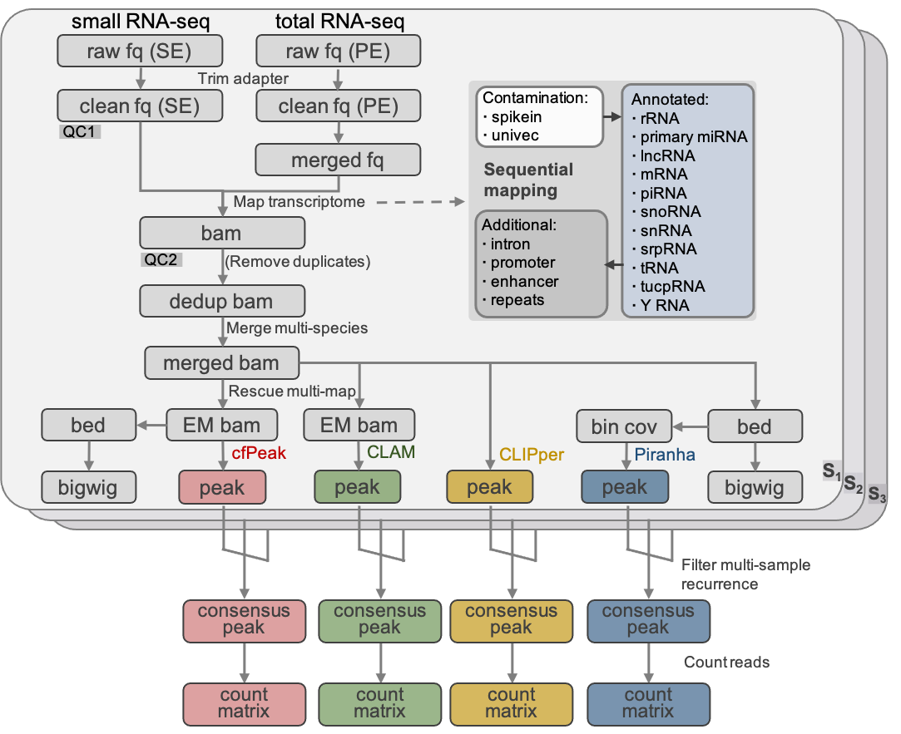

<!-- PROJECT SHIELDS -->

<!--
*** I'm using markdown "reference style" links for readability.
*** Reference links are enclosed in brackets [ ] instead of parentheses ( ).
*** See the bottom of this document for the declaration of the reference variables
*** for contributors-url, forks-url, etc. This is an optional, concise syntax you may use.
*** https://www.markdownguide.org/basic-syntax/#reference-style-links
-->

[Contributors][contributors-url]
[Forks][forks-url]
[Stargazers][stars-url]
[Issues][issues-url]

<!-- [![GPL-2.0 License][license-shield]][license-url] -->

<!-- PROJECT LOGO -->

<br />
<p align="center">
  <a href="https://github.com/hunnngry/cfPeak">
    
  </a>

<h2 align="center">cfPeak</h2>

<p align="center">
    cfPeak, peak analysis of cell-free RNA finds recurrently protected narrow regions with clinical potential
  </p>
</p>

<!-- TABLE OF CONTENTS -->

<details open="open">
  <summary><h2 style="display: inline-block">Table of Contents</h2></summary>
  <ol>
    <li>
      <a href="#about-the-project">About The Project</a>
    </li>
    <li>
      <a href="#getting-started">Getting Started</a>
      <ul>
        <li><a href="#prerequisites">Prerequisites</a></li>
        <li><a href="#installation">Installation</a></li>
      </ul>
    </li>
    <li><a href="#usage">Usage</a></li>
    <li><a href="#References">References</a></li>
    <li><a href="#license">License</a></li>
    <li><a href="#contact">Contact</a></li>
    <li><a href="#acknowledgements">Acknowledgements</a></li>
    <li><a href="#appendix">Appendix</a></li>
  </ol>
</details>

<!-- ABOUT THE PROJECT -->

## About The Project

We have discovered vast number of narrow regions protected from degradation from plasma sm/miRNA-seq using a new computational method and data pipeline with multiple advantages for peak analysis in cell-free RNA-seq, which is also potentially applicable to other data types, including traditional cellular CLIP-seq or RIP-seq.

<!-- PROJECT pipeline -->

<br />
<p align="center">
  <a href="https://github.com/hunnngry/cfPeak">
    
  </a>

<!-- PROJECT modules -->

<br />
<p align="center">
  <a href="https://github.com/hunnngry/cfPeak">
    
  </a>

<!-- GETTING STARTED -->

## Getting Started

Following steps below to get a local copy and run

### Prerequisites

* slurm or lsf cluster system, PC or server with >=16 cores and >=64 GB memory
* mamba/anaconda/miniconda installed (https://mamba.readthedocs.io/en/latest/installation.html, https://www.anaconda.com/download)

### Installation

1.Clone the repo

```sh
git clone https://github.com/hunnngry/cfPeak.git
```

2.Create conda global environment

```sh
cd cfPeak
# The default conda solver is a bit slow and sometimes has issues with selecting the special version packages. We recommend to install mamba as a drop-in replacement
## option 1: install mambaforge (mamba included)
curl -L -O "https://github.com/conda-forge/miniforge/releases/Mambaforge-$(uname)-$(uname -m).sh"
bash Mambaforge-$(uname)-$(uname -m).sh

## option 2 (not recommended, many conflicts exist): use exist conda 
#conda install -n base --override-channels -c conda-forge mamba 'python_abi=*=*cp*'
export PATH=~/mambaforge/bin:$PATH # you can add this line to ~/.bashrc
mamba env create -n cfpeak -f ./snakemake/envs/cfpeak.yml
```

3.Prepare necessary genome/transcriptome reference file and annotation

* you can create your own reference of annotation file, create dirs bellow in root of snakemake: genome/hg38
  * genome/hg38/fasta_newTxID stores fasta files of multi tx species
  * genome/hg38/chrom_sizes stores txt files of chrom.sizes of full-length tx
  * genome/hg38/transcript_table stores meta table of all tx for counting matrix
* we provided some example files of human hg38 fasta, chrom_sizes, and annotation track files used in the article can be downloaded from https://clo
  ud.tsinghua.edu.cn/f/9d8cee33da6e4aacbc40/?dl=1

4.Create snakemake pipeline environment

__a.__required for all

```sh
# activate global environment
source activate cfpeak
# if you need to run cell-free smallRNA-seq:
snakemake --use-conda --conda-create-envs-only -j 1 --configfile config/test_small.yaml -s snakemake/call_peaks.snakemake
# if you need to run cell-free totalRNA-seq:
snakemake --use-conda --conda-create-envs-only -j 1 --configfile config/test_long.yaml -s snakemake/call_peaks_long.snakemake
# some other config and snakemake files are also provided to meet different input types 
```

> you may meet error like "ModuleNotFoundError: No module named _sysconfigdata_x86_64_conda_linux_gnu" when creating conda environment, this is conda bug may be solved by updateing python or copy file from elsewhere, details see https://stackoverflow.com/questions/68261254/conda-error-sysconfigdata-x86-64-conda-linux-gnu

__b.__optional: if you need to run Piranha (v1.2.1)

* By default, basical env (snakemake/envs/piranha.yml) that needed to run Piranha has already installed in last step, but need install countreg and bedtoolsr package manually to make it run (countreg pkg unfortunately is not yet on conda; and r-bedtoolsr in current conda repo requires R version >=4, in which cfPeak is not fully tested). First, locate your installed conda environments (by default in .snakemake/conda/[hash]); you can see the message when first create env, or else you can find out which [hash].yml file corresponds with the environment named piranha. Second, load that environment with conda activate .snakemake/conda/[hash]. Third, run R to enter the R shell
  * install.packages("countreg", repos="http://R-Forge.R-project.org", version="0.2-1")
  * devtools::install_github("PhanstielLab/bedtoolsr", version="2.30.0-5") # you may update version
* We provide two optional piranha version: in-house adapted cell-free Piranha software and simplified Piranha pkg in R (default). Users could switch to the former Piranha version in peak_common.snakemake by commenting rule call_peaks_piranha and uncommenting rule call_peaks_piranha2 if needed.

__c.__optional: if you need to run CLIPper (v2.1.2)

* install CLIPper according to https://github.com/YeoLab/clipper
* modify to suit tx-mapping mode:
  * find installed path of CLIPper call peak python script (e.g., ~/anaconda3/envs/clipper3/lib/python3.7/site-packages/clipper/src/call_peak.py)
    * mask 927-929 rows (or else it will add "chr" prefix in seqnames and cause error)
  * find main python script (e.g., ~/anaconda3/envs/clipper3/lib/python3.7/site-packages/clipper/src/main.py)
    * remove  comment of  203,204,209 rows (parameters: reverse_strand False  max_width  min_width )
    * comment 232-234 rows
* use hg38_tx reference provided in cfpeak (hg38txNoDNAnewTxID.gff in https://cloud.tsinghua.edu.cn/f/56a32fe1b3624326b4c8/?dl=1) or you can add your own reference according to https://github.com/YeoLab/clipper/wiki/Supporting-additional-species (and remember to change your ref id in rule:call_peaks_clipper)

__d.__optional: if you need to run CLAM (v1.2.0)

* install CLIPper according to https://github.com/Xinglab/CLAM
* modify to suit tx-mapping mode:
  * modify permutation_callpeak.py： row#439，(this fixed error for not considering left boundary less than 0 when defining flag: --extend)
* use hg38_tx reference provided in cfpeak (hg38txNoDNAnewTxID.gtf in https://cloud.tsinghua.edu.cn/f/98fcbf2ad0ee4f088bee/?dl=1) or you can add your own reference

<!-- USAGE EXAMPLES -->

## Usage

1.Activate the created global environment (anaconda3 or mambaforge)

```sh
source activate cfpeak 
dst="test_small"
```

2.Prepare/modify the config and metadata file based on your need

* detailed config and description are stored in **${dst}.yaml** file under **config_dir** directory your defined in the config file (default: config)
* metadata of sample ids is stored in **sample_ids.txt** file under **data_dir** directory your defined in the config file (default: data/$dst).

3.Prepare clean fastq data

* fq_trimming steps are currently included for this peak pipeline, inefficient cleaning might happen due to different library strategies.
* your may need **trim_galore** or **fastp** for auto adapter detection, or use **cutadapt** if you are fully aware of the adapter sequences.
* prepare clean fastq ({sample_id}.fastq.gz) into the **trimmed** directory under **output_dir** directory your defined in the config file (default: output/$dst).

4.1.Run in server

```sh
snakemake \
  --rerun-incomplete --keep-going --printshellcmds --reason --use-conda --nolock --latency-wait 20 --restart-times 1 --jobs 14 \
  --snakefile snakemake/call_peaks.snakemake \
  --configfile config/${dst}.yaml \
  > logs/${dst}/run-${dst}.log 2>&1 &
```

4.2.Run in cluster

```sh
snakemake \
  --rerun-incomplete --keep-going --printshellcmds --reason --use-conda --nolock --latency-wait 20 --restart-times 1 --jobs 14 \
  --snakefile snakemake/call_peaks.snakemake \
  --configfile config/${dst}.yaml \
  --cluster-config snakemake/cluster/cluster_slurm.json \
  --cluster "sbatch --cpus-per-task 1 -n {cluster.threads} -J {cluster.jobname} -p {cluster.partition}  {cluster.resources} -o {cluster.output} -e {cluster.error}" \
  > logs/${dst}/run-${dst}.log 2>&1 &
```

5.Check output

* cfPeak sample peak file: output/test_small/call_peak_all/cfpeak_by_sample/b5_d50_p1/s1.bed
  * the columns represent “transcript, start, end, name, maximum depth, strand, maximum position, background depth, permutation FDR, Poisson P-value” from left to right
* cfPeak sample peak file (filtered by CNN): output/test_small/call_peak_all/cfpeakCNN_by_sample/b5_d50_p1/s1.bed
  * the columns represent “transcript, start, end, name, probability to be false peak (0-1), strand” from left to right
* cfPeak consensus peak file: output/test_small/call_peak_all/cfpeak/b5_d50_p1.bed
* cfPeak consensus peak count matrix: output/test_small/call_peak_all/count_matrix/cfpeakCNN_b5_d50_p1.txt
  * value represent read count in each peak regions; first column represents peak name, other columns represent all sample IDs

<!-- LICENSE -->

## License

Distributed under the GPL-2.0 License License. See `LICENSE` for more information.

<!-- CONTACT -->

## Contact

@hunnngry (b.p.f@qq.com)

@lulab (lulab1@tsinghua.edu.cn)

<!-- References -->

## References

* submitted, 2023, CfRNA peak analysis finds recurrently protected narrow regions with clinical potential.

## Appendix

other additional example reference files, figure scripts, matrices, and tables related to this paper can be found at https://drive.google.com/file/d/1cGRh23eLpr6xaFDf3Zy3DhlJ0U3ahbEO/view?usp=drive_link or https://cloud.tsinghua.edu.cn/d/bc54116786fa4cd9bbf0/

<!-- ACKNOWLEDGEMENTS -->

<!-- MARKDOWN LINKS & IMAGES -->

<!-- https://www.markdownguide.org/basic-syntax/#reference-style-links -->

<!-- [license-shield]: https://img.shields.io/github/license/hunnngry/cfPeak.svg?style=for-the-badge

[license-url]: https://github.com/hunnngry/cfPeak/blob/master/LICENSE.txt -->

[contributors-shield]: https://img.shields.io/github/contributors/hunnngry/cfPeak.svg?style=for-the-badge
[contributors-url]: https://github.com/hunnngry/cfPeak/graphs/contributors
[forks-shield]: https://img.shields.io/github/forks/hunnngry/cfPeak.svg?style=for-the-badge
[forks-url]: https://github.com/hunnngry/cfPeak/network/members
[stars-shield]: https://img.shields.io/github/stars/hunnngry/cfPeak.svg?style=for-the-badge
[stars-url]: https://github.com/hunnngry/cfPeak/stargazers
[issues-shield]: https://img.shields.io/github/issues/hunnngry/cfPeak.svg?style=for-the-badge
[issues-url]: https://github.com/hunnngry/cfPeak/issues
